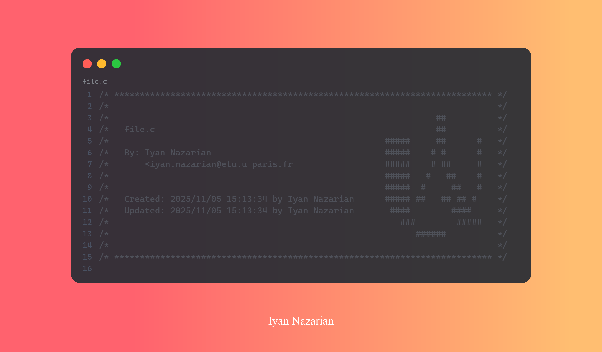

<a href="https://u-paris.fr/">
  
</a>
<br>
<h1 align="center"> UParis Header</h1>
<br>

Forked and quasi-inspired from [Diogo Silva's 42-header.nvim](https://github.com/Diogo-ss/42-header.nvim).  

<hr>

## ✨ Features

- Command: `UPheader`
- Auto update on save (optional)
- Supports `commentstring`
- Supports Git

## 🚀 Showcase



## 🎈 Setup

<details>
  <summary>📦 Packer.nvim</summary>

```lua
use {
  "fxmouskid/uparis-header.nvim",
  cmd = { "UPheader" },
  config = function()
    require("uparis-header").setup {
      default_map = true, -- Default mapping <F1> in normal mode.
      auto_update = true, -- Update header when saving.
      user = "username", -- Your user.
      mail = "your@email.com", -- Your mail.
    -- add other options.
    }
  end,
}
```

</details>

<details>
  <summary>💤 Lazy.nvim</summary>

```lua
{
  "fxmouskid/uparis-header.nvim",
  cmd = { "UPheader" },
  keys = { "<F1>" },
  opts = {
    default_map = true, -- Default mapping <F1> in normal mode.
    auto_update = true, -- Update header when saving.
    user = "username", -- Your user.
    mail = "your@email.com", -- Your mail.
    -- add other options.
  },
  config = function(_, opts)
    require("uparis-header").setup(opts)
  end,
}
```

</details>

## ⚙ Options

```lua
{
  ---Max header size (not recommended change).
  --length = 80,
  ---Header margin (not recommended change).
  --margin = 5,
  ---Activate default mapping (e.g. F1).
  default_map = true,
  ---Enable auto-update of headers.
  auto_update = true,
  ---Default user.name.
  user = "username",
  ---Default user.email.
  mail = "your@mail.com",
  ---ASCII art.
  --asciiart = { "---", "---", ... },
  ---Git config.
  git = {
    ---Enable Git support.
    enabled = false,
    ---PATH to the Git binary.
    bin = "git",
    ---Use global user.name, otherwise use local user.name.
    user_global = true,
    ---Use global user.email, otherwise use local user.email.
    email_global = true,
  },
}
